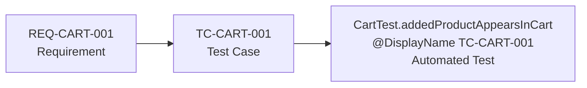

# SauceDemo QA Automation

End-to-end UI test automation for [SauceDemo](https://www.saucedemo.com), built as a
**full QA workflow** — not just Selenium scripts. It demonstrates the complete chain a
professional tester owns:

```
Requirements  →  Test Cases  →  Traceability (RTM)  →  Test Plan  →  Automation
```

Every automated test traces back to a documented test case, which traces back to a
requirement — so anyone can answer *"is REQ-CART-001 tested?"* by following the chain.

---

## 🧰 Tech Stack

| Layer | Choice |
|-------|--------|
| Language | Java 21 |
| Automation | Selenium WebDriver 4.27 (built-in Selenium Manager — no manual driver setup) |
| Test framework | JUnit 5 |
| Build | Apache Maven |
| Design pattern | Page Object Model (POM) |
| Browser | Google Chrome (headless) |

---

## 📊 Scope & Coverage

| Module | Requirements | Test Cases | Automated | Status |
|--------|:---:|:---:|:---:|:---:|
| Login | 5 | 6 | 6 | ✅ |
| Products | 4 | 7 | 7 | ✅ |
| Cart | 4 | 4 | 4 | ✅ |
| Checkout | 4 | 4 | 4 | ✅ |
| **Total** | **17** | **21** | **21** | **✅ 100%** |

Plus a **SmokeTest** as a fail-fast sanity check → **22 automated tests, all green.**

Test design uses **equivalence partitioning** and both **positive** and **negative**
scenarios (invalid login, locked-out user, empty required fields, etc.).

---

## 🔗 Traceability Chain



Each test method carries its test-case ID via `@DisplayName`, so the ID appears in test
reports — closing the loop from requirement to running code.

---

## 📁 Project Structure

```
SauceDemo/
├── docs/
│   ├── 01_requirements.xlsx   # 17 requirements (id, priority, positive/negative)
│   ├── 02_rtm.xlsx            # Requirements Traceability Matrix (+ coverage summary)
│   ├── 03_test_cases.xlsx     # 21 test cases (steps, data, expected result)
│   └── 04_test_plan.docx      # ISTQB-style test plan
├── src/test/java/
│   ├── base/
│   │   └── BaseTest.java       # Headless Chrome setup/teardown (@BeforeEach/@AfterEach)
│   ├── pages/                  # Page Object Model
│   │   ├── LoginPage.java
│   │   ├── ProductsPage.java
│   │   ├── CartPage.java
│   │   └── CheckoutPage.java
│   ├── tests/                  # Test suites (one class per module)
│   │   ├── LoginTest.java
│   │   ├── ProductsTest.java
│   │   ├── CartTest.java
│   │   ├── CheckoutTest.java
│   │   └── SmokeTest.java
│   └── utils/
│       └── ElementHelper.java  # Shared wait + retry + stale-element handling
├── pom.xml
└── README.md
```

---

## ▶️ How to Run

**Prerequisites:** Java 21, Maven, and Google Chrome installed.

Run the whole suite from the command line:

```bash
mvn test
```

Or run a single module / test in IntelliJ IDEA with the green ▶ gutter icon.

Tests run **headless** by default (no visible browser window), which is faster and
CI-friendly.

---

## ⭐ Engineering Highlights

- **Page Object Model** — each page's locators and actions live in one class; tests read
  as scenarios, not raw Selenium calls.
- **`ElementHelper`** — a single reusable utility that wraps every interaction with
  explicit waits and retry logic, so flaky `StaleElementReferenceException` failures are
  handled in one place instead of scattered across the codebase.
- **Flaky-test hardening** — the cart page re-rendered aggressively under a bleeding-edge
  Chrome build; solved with JavaScript click + retry loops and `stalenessOf` waits
  (avoiding the implicit/explicit wait anti-pattern).
- **Headless execution** via `ChromeOptions`, ready for CI pipelines.
- **Test users** — `standard_user` for happy paths, `locked_out_user` for negative
  scenarios.

---

## 📌 Test Users

| Username | Purpose |
|----------|---------|
| `standard_user` | Positive / happy-path scenarios |
| `locked_out_user` | Locked-out negative scenario |

Password for all users: `secret_sauce`

---

## 👤 Author

**Mehmet Emre Sezer** — ISTQB Foundation Level certified.
